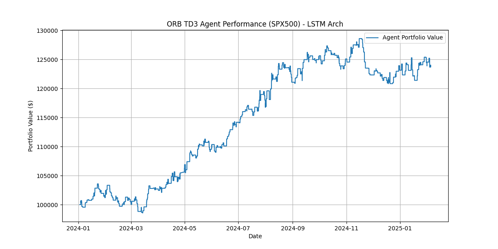
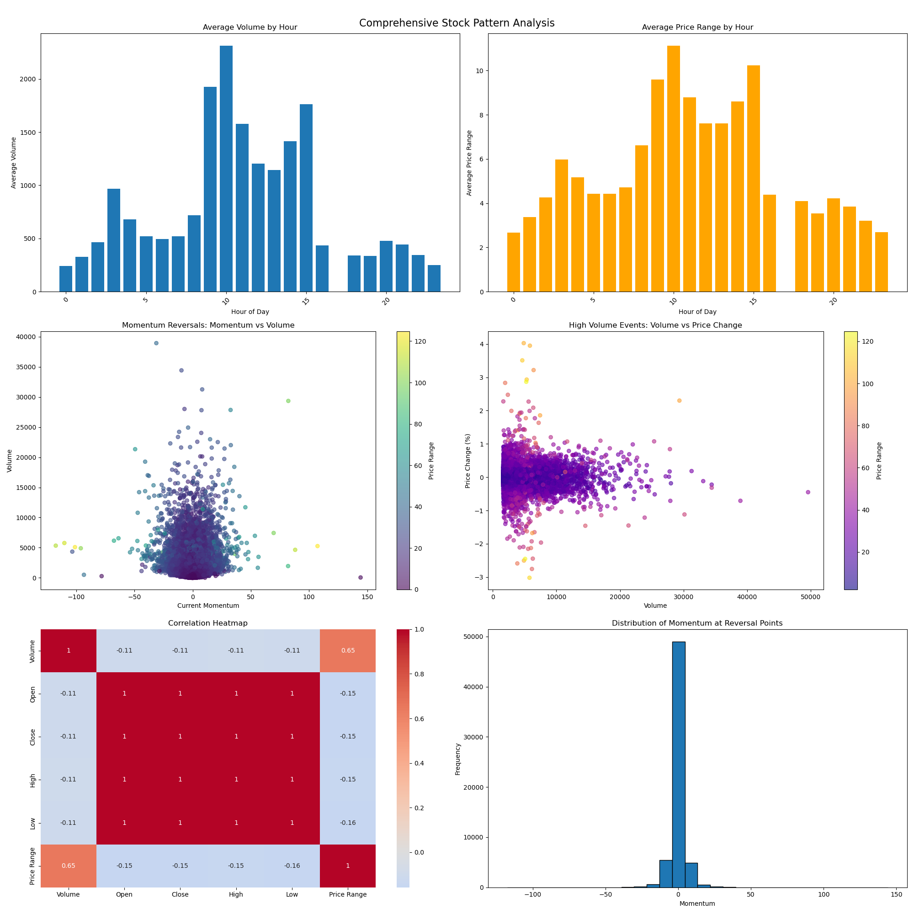
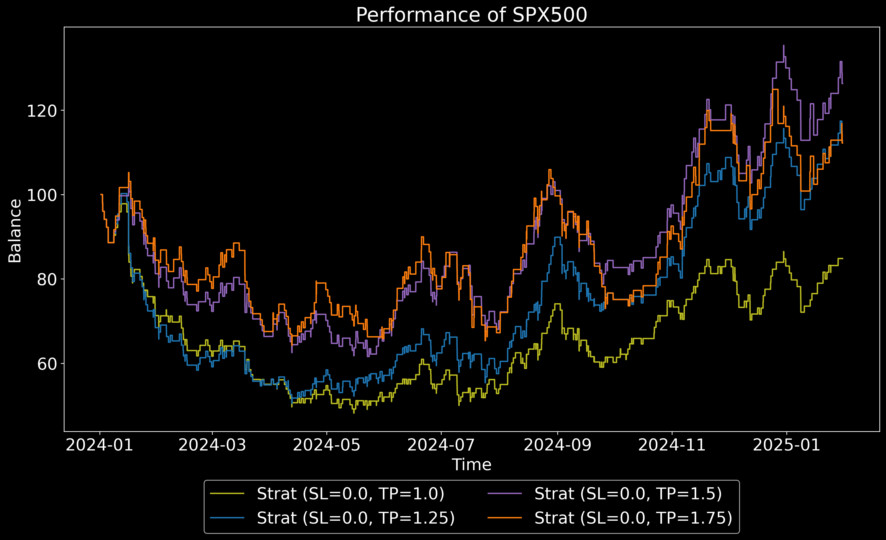
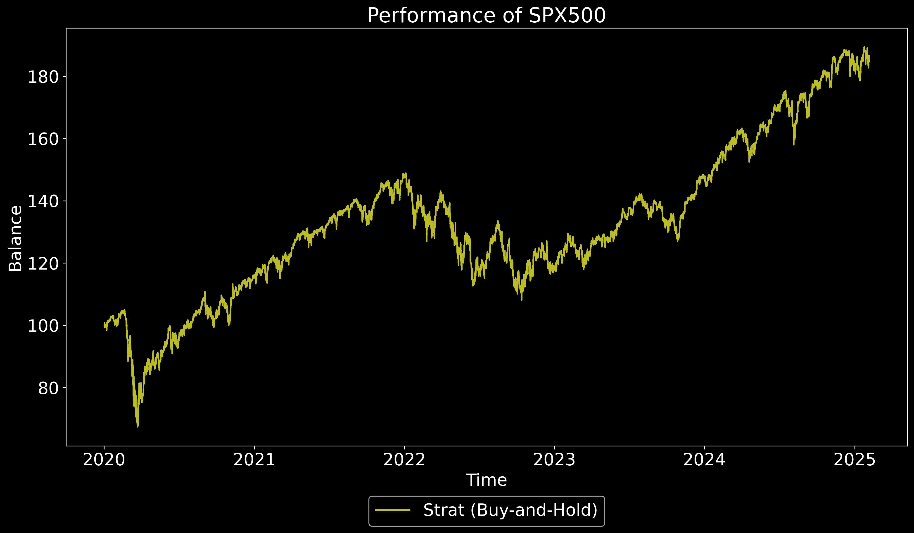

# Risk-Reward Optimized Stock Market Analytics and Prediction: A Deep Learning Framework

## Project Advisor
- Dr. Kar Gorkem (kar@ucmo.edu)

## Graduate Researcher
- Nidhin Ninan (nxn24130@ucmo.edu)

## Overview

This project introduces a two-phase approach to optimize financial market prediction and trading strategies. The first phase focuses on evaluating a dynamic scaling parameter, alpha, to determine optimal risk-reward thresholds (stop-loss and take-profit levels). The second phase implements a novel deep learning framework to predict these optimal alpha values in real-time, enabling more sophisticated and automated trading strategies with precise risk control.

## Implementations

### 1. Pattern Analysis (`PatternAnalysis_Stock.ipynb`)

This Jupyter notebook conducts a detailed analysis of historical stock data to identify trading patterns and correlations. Key analyses include:

- **Hourly Volatility Analysis:** Examines trading volume, price range, and momentum to identify peak trading hours.
- **Momentum Reversal Analysis:** Detects trend reversals by analyzing changes in momentum indicators.
- **High-Volume Price Impact Analysis:** Identifies significant price movements during periods of high trading volume.

### 2. Deep Reinforcement Learning Model (`DeepRL_Stock_LSTM.ipynb`)

This notebook contains the core deep learning model of the project. It implements a Twin-Delayed Deep Deterministic Policy Gradient (TD3) algorithm with a custom Long Short-Term Memory (LSTM) network. This model is designed to predict optimal trading strategies by learning from historical market data and technical indicators.

### 3. Opening Range Breakout (ORB) Strategy (`Pinescripts/Custom_BreakoutRange.pine`)

This is an experimental trading strategy written in Pine Script for the TradingView platform. It implements an Opening Range Breakout (ORB) strategy based on the concepts explored in the research. The script calculates the trading range within the first 15 minutes of the market opening and executes trades based on breakouts from this range, incorporating a configurable risk-reward ratio.

## How to Use

- **Jupyter Notebooks:** The `PatternAnalysis_Stock.ipynb` and `DeepRL_Stock_LSTM.ipynb` notebooks can be run in a Jupyter environment with the necessary Python libraries installed.
- **Pine Script:** The `Custom_BreakoutRange.pine` script can be imported into the Pine Editor on TradingView to backtest the ORB strategy on historical data.

## Results

### Portfolio Value (TD3+LSTM)

### Pattern Analysis

### ORB Strategy vs. Buy and Hold

*ORB Strategy Performance*

*Buy and Hold Performance*
